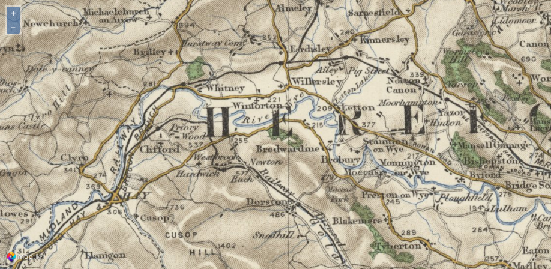
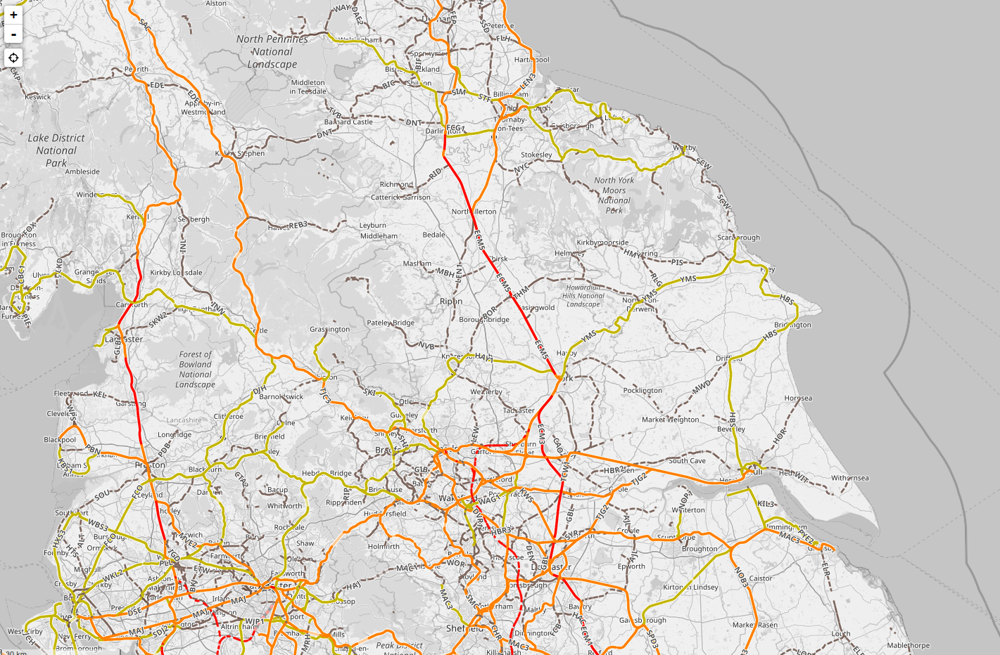

# Extracting railway data for UK from OSM and Overture Maps


The code below extracts railway data for the UK from OpenStreetMap (OSM)
using the `osmextract` package, and also demonstrates how to use DuckDB
to query railway data from Overture Maps. The extracted data is then
filtered for specific regions such as Leeds and Yorkshire and the
Humber, and saved as GeoPackage files.

See the [releases
page](https://github.com/itsleeds/openraildata/releases) for the
resulting GeoPackage files.

Four main datasets are saved there:

- `uk_railways_osm.gpkg`: All railways in the UK from OSM, available at
  [github.com/itsleeds/openraildata/releases/download/v1/uk_railways_osm.gpkg](https://github.com/itsleeds/openraildata/releases/download/v1/uk_railways_osm.gpkg)
- `leeds_railways.gpkg`: Railways in Leeds from OSM, available at
  [github.com/itsleeds/openraildata/releases/download/v1/leeds_railways.gpkg](https://github.com/itsleeds/openraildata/releases/download/v1/leeds_railways.gpkg)
- `rail_yorkshire_humber.gpkg`: Railways in Yorkshire and the Humber
  from OSM, available at
  [github.com/itsleeds/openraildata/releases/download/v1/rail_yorkshire_humber.gpkg](https://github.com/itsleeds/openraildata/releases/download/v1/rail_yorkshire_humber.gpkg)
- `yorkshire_humber_abandoned_railways.gpkg`: Abandoned railways in
  Yorkshire and the Humber from OSM, available at
  [github.com/itsleeds/openraildata/releases/download/v1/yorkshire_humber_abandoned_railways.gpkg](https://github.com/itsleeds/openraildata/releases/download/v1/yorkshire_humber_abandoned_railways.gpkg)

The following commands show how you can download and use the datasets in
R:

``` r
library(tmap)
url_abandoned_railways = "https://github.com/itsleeds/openraildata/releases/download/v1/yorkshire_humber_abandoned_railways.gpkg"
abandoned_railways = sf::read_sf(url_abandoned_railways)
tm_shape(abandoned_railways) +
  tm_lines(col = "highway") +
  tm_layout(title = "Abandoned railways in Yorkshire and the Humber")
```

    [v3->v4] `tm_layout()`: use `tm_title()` instead of `tm_layout(title = )`

<div id="fig-abandoned-railways">


Figure 1

</div>

There are literally tonnes of records out there in various archived
locations and for sure research in this space is feasible.

Relevant resources:

- [The Spatial Impacts of a Massive Rail Disinvestment Program: The
  Beeching Axe](http://cep.lse.ac.uk/pubs/download/dp1563.pdf) - Paper
  by Ted Pinchbeck and others.

- [Historical Transport Infrastructure Dataset for Britain
  (1870-1937)](https://policycommons.net/artifacts/3159934/historical-infrastructure-dataset-pilot/3957822/) -
  Dataset commissioned by the National Infrastructure Commission.

- [UK OSGB 1888 Map
  Tiles](https://cloud.maptiler.com/tiles/uk-osgb1888/) - Source for
  historic map data.

- [OpenRailwayMap](https://www.openrailwaymap.org/) - Visualisation of
  global railway data based on OpenStreetMap.

A map from the final link above is shown below, which shows the disused
“Midland Railway” line from Hay to Hereford.



Below is a visualisation of open rail data from OSM on
OpenRailwayMap.org:



<details>

summary\>Click to expand code
</summary>

``` r
library(duckdb)
library(sf)
library(tidyverse)
library(pct)
```

``` r
# Get the dataset with osmextract package:
library(osmextract)
tic = Sys.time()
query = "SELECT * FROM lines WHERE railway IS NOT NULL"
extra_tags = c(
    "railway", # abandoned, rail etc."
    "usage",           # Usage type (e.g. branch, main, freight)
    "electrified",     # Power source (e.g. contact_line)
    "frequency",       # Electrical frequency (Hz)
    "gauge",           # Track gauge (mm)
    "maxspeed",        # Maximum speed
    "operator",        # Operator name
    "railway:aws",     # Automatic Warning System
    "railway:tpws",    # Train Protection and Warning System
    "ref",             # Reference code
    "voltage",         # Voltage
    "layer",           # Relative vertical position
    "tracks",          # Number of tracks
    "passenger_lines",  # Number of passenger lines
    # Active travel related ones: 3 "foot"=>"yes","lit"=>"no","segregated"=>"no","smoothness"=>"good","surface"=>"asphalt"
    "foot",
    "lit",
    "segregated",
    "smoothness",
    "surface",
    "width",
    "bicycle"
)
tic = Sys.time()
uk_rail_osm = oe_get("United Kingdom", layer = "lines", extra_tags = extra_tags, query = query)
toc = Sys.time()
print(toc - tic)
dim(uk_rail_osm)
head(uk_rail_osm)
sf::write_sf(uk_rail_osm, "uk_railways_osm.gpkg")
```

``` r
# 2011 MSOAs
zones = pct::get_pct_zones("west-yorkshire")
zones_leeds = zones |>
  filter(lad_name == "Leeds")
leeds_boundary = st_union(zones_leeds)
rail_leeds = st_intersection(uk_rail_osm, leeds_boundary)
sf::write_sf(rail_leeds, "leeds_railways.gpkg")
```

``` r
# Get data for yorkshire and the humber:
zones_soyo = pct::get_pct_zones("south-yorkshire")
zones_noyo = pct::get_pct_zones("north-yorkshire")
zones_humber = pct::get_pct_zones("humberside")
zones_wyca = pct::get_pct_zones("west-yorkshire")
zones_combined = rbind(zones_soyo, zones_noyo, zones_humber, zones_wyca)
sf::sf_use_s2(FALSE)
yorkshire_humber_boundary = st_union(zones_combined)
rail_yorkshire_humber = st_intersection(uk_rail_osm, yorkshire_humber_boundary)
nrow(rail_yorkshire_humber)
sf::write_sf(rail_yorkshire_humber, "rail_yorkshire_humber.gpkg")


rail_yorkshire_abandoned = rail_yorkshire_humber |>
  filter(grepl("abandoned|disused|dismantled", railway))
sf::write_sf(rail_yorkshire_abandoned, "yorkshire_humber_abandoned_railways.gpkg")
```

``` r
# Upload
system("gh release create v1")
system("gh release upload v1 leeds_railways.gpkg --clobber")
# upload rail_yorkshire_humber.gpkg
system("gh release upload v1 rail_yorkshire_humber.gpkg --clobber")
# Abandonded railways
system("gh release upload v1 yorkshire_humber_abandoned_railways.gpkg --clobber")
# UK railways
system("gh release upload v1 uk_railways_osm.gpkg --clobber")
```

``` r
# Connect to DuckDB (worked well but provided data in weird format, lots of list columns):
con = dbConnect(duckdb())

# Install and load spatial and httpfs extensions
dbExecute(con, "INSTALL spatial; LOAD spatial;")
dbExecute(con, "INSTALL httpfs; LOAD httpfs;")

# Set S3 region for Overture Maps
dbExecute(con, "SET s3_region='us-west-2';")

# Define the query
# 1. Use the specific Overture release (2025-11-19.0)
# 2. Filter by UK Bounding Box (approximate)
# 3. Filter for railways (subtype or class containing 'rail')
# Note: 'read_parquet' efficiently reads the remote parquet files using the httpfs extension.
query = "
SELECT
  * EXCLUDE (geometry),
  ST_AsWKB(geometry) AS geometry
FROM read_parquet('s3://overturemaps-us-west-2/release/2025-11-19.0/theme=transportation/type=segment/*')
WHERE
  bbox.xmin > -14 AND bbox.xmax < 2 AND
  bbox.ymin > 49 AND bbox.ymax < 61 AND
  (
    subtype LIKE '%rail%' OR
    class LIKE '%rail%'
  )
"

# Execute query and load directly into an sf object
# st_read can read directly from the DuckDB connection
uk_rail = st_read(con, query = query, geometry_column = "geometry", quiet = TRUE)

nrow(uk_rail)
names(uk_rail)
#  [1] "id"                     "bbox"                   "version"
#  [4] "sources"                "subtype"                "class"
#  [7] "names"                  "connectors"             "routes"
# [10] "subclass_rules"         "access_restrictions"    "level_rules"
# [13] "destinations"           "prohibited_transitions" "road_surface"
# [16] "road_flags"             "speed_limits"           "width_rules"
# [19] "subclass"               "rail_flags"             "theme"
# [22] "type"                   "geometry"
# Disconnect
# Pull out railway=related flags currently in list column: 

dbDisconnect(con)

# Check the result
print(uk_rail)

uk_rail_minimal = uk_rail |>
  select(id, subtype, class, rail_flags) |>
  mutate(rail_flags = paste(rail_flags, collapse = ";"))
write_sf(uk_rail_minimal, "uk_railways_minimal.gpkg")
```

``` r
# Get the data with osmdata package (failed):
library(osmdata)
tic = Sys.time()
uk_rail_osm = opq(bbox = "United Kingdom") |>
  add_osm_feature(key = "railway") |>
  osmdata_sf()
toc = Sys.time()
print(toc - tic)
```

For further online resources, see
[here](https://gemini.google.com/share/ca1b64cd049f).
